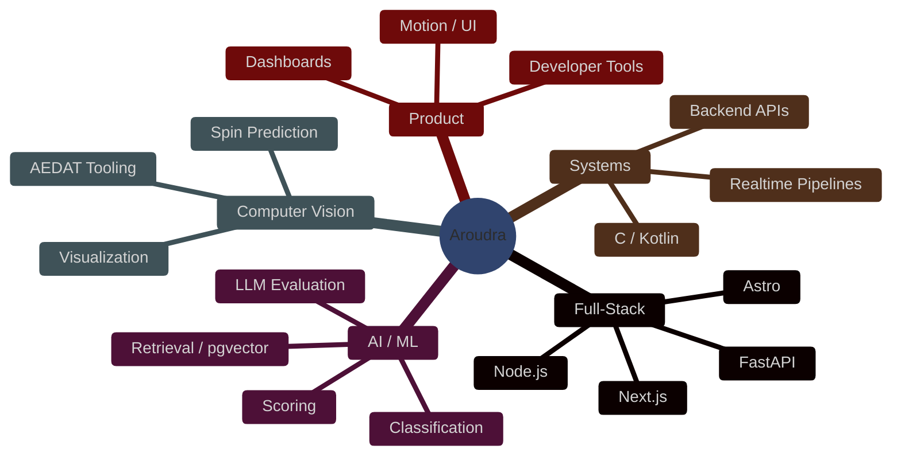
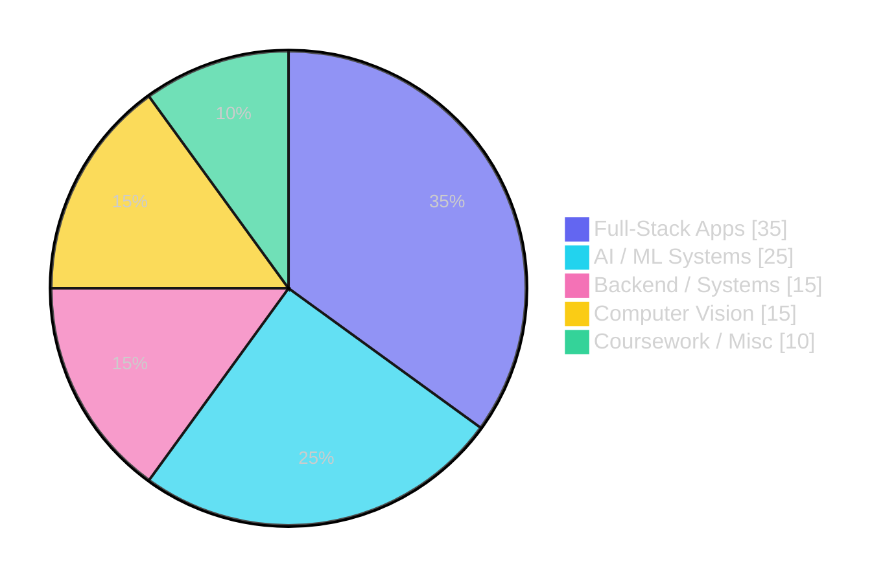

<h1 align="center">
  Hi there, I'm Aroudra
  
</h1>

  

  
  
  
  

##  About Me

<table>
  <tr>
    <td width="62%" valign="top">

I like building products that sit at the intersection of software engineering, data, and applied intelligence. A lot of my recent work has been in TypeScript and Python, with projects spanning web apps, Android, computer vision, data tooling, and backend systems.

Right now, the repos on this profile mostly cluster around:

-  Full-stack product builds with React, Next.js, Astro, FastAPI, and Node.js
-  AI and ML workflows: retrieval, scoring, classification, and investigator tooling
-  Computer vision and visualization projects
-  Coursework and systems projects in C, PHP, Kotlin, and Python

</td>
    <td width="38%" align="center">
      
    </td>
  </tr>
</table>

##  GitHub Stats

  
  

  
  

###  Contribution Activity

  

  

###  Where My Work Lives

###  How My Time Splits Across Domains

##  Featured Projects

###  Silo

Silo is a prompt drift and evaluation platform for teams shipping LLM-powered features. It helps compare accepted baseline prompts against new candidate versions, run staged evaluations over stored test cases, surface pass/fail outcomes, and provide the diagnostics needed to understand why a prompt regressed or improved.

This is one of the most systems-heavy projects I have worked on because it sits at the intersection of developer tooling, evaluation design, and product infrastructure. The platform supports prompt suites, explicit test-case generation, staged evaluation, disagreement-based judge sampling, early-stop behavior for CI and iteration workflows, human review paths, and operator-facing observability for per-case history and optimization telemetry. It also includes a published CLI for automation and CI integration. The project is currently private, but it is actively developed and the npm package has already reached 500+ users.

- Focus areas: LLM evaluation infrastructure, prompt versioning, drift detection, CI workflows, developer tooling
- Stack: Python, FastAPI, Next.js, Supabase, TypeScript
- CLI: [`silo-drift-cli`](https://www.npmjs.com/package/silo-drift-cli)
- Live frontend: [silo-frontend.onrender.com](https://silo-frontend.onrender.com)
- Live backend: [silo-siix.onrender.com](https://silo-siix.onrender.com)
- Status: Private project under active development

###  Cicada AML

Blockchain AML investigation platform built for investigator-facing analysis of suspicious wallets, transaction flows, and laundering patterns. The system is designed around a heuristics-first workflow, then layers in ML scoring, clustering, and explanation tooling so the output is useful to an analyst instead of just a raw risk score.

What makes this project interesting to me is the mix of applied machine learning and product design. It handles structured blockchain data, builds wallet graphs, evaluates a large set of AML heuristics, compares multiple model perspectives, and surfaces the results in a dashboard that supports exploration, reporting, and case review. The project pushed me to think across backend design, model orchestration, data interpretation, and how to present technical signals in a way that supports real decisions.

- Focus areas: graph-based transaction analysis, suspicious-activity detection, explainability, investigator workflows
- Stack: Python, FastAPI, React, Vite, Tailwind
- Repo: [Cicada-AML](https://github.com/aroudrasthakur/Cicada-AML)

###  Auto Resume

Auto Resume is an AI-powered resume generation platform built around matching the right content to the right opportunity instead of just filling a template. It combines structured profile data, vector-based similarity, AI-assisted optimization, and deterministic rendering so the generated resume stays both tailored and consistent.

The project stands out because it treats resume generation like an actual product pipeline rather than a one-off AI demo. It includes CRUD flows for user profile data, semantic matching with pgvector, authentication, export handling, and a rendering pipeline based on LaTeX. That made it a strong exercise in balancing user experience, backend reliability, document generation, and security considerations around sensitive personal data.

- Focus areas: retrieval and ranking, document generation, secure user data flows, production-oriented full-stack design
- Stack: Next.js, TypeScript, PostgreSQL/pgvector, LaTeX
- Repo: [auto_resume](https://github.com/aroudrasthakur/auto_resume)

###  Nixo Slackbot

Nixo Slackbot is a realtime message triage and ticketing system built for Forward-Deployed Engineer workflows. It watches Slack conversations, identifies relevant customer messages, classifies and groups them into tickets, and pushes the results into a dashboard where teams can track priority, status, and related context in real time.

The part I like most here is the operational systems thinking behind it. This project is not just about calling an LLM on a message. It has to handle message grouping, pipeline behavior, classification quality, realtime updates, and race-condition prevention so the dashboard stays reliable even when messages arrive concurrently. It is a good example of combining LLM-assisted workflows with practical backend constraints and a product interface that needs to stay trustworthy.

- Focus areas: realtime systems, Slack automation, LLM-assisted classification, ticket aggregation, operational dashboards
- Stack: TypeScript, Next.js, OpenAI, Supabase, Socket.IO
- Repo: [nixo-slackbot](https://github.com/aroudrasthakur/nixo-slackbot)

###  Personal Website

My personal website is where I bring together engineering, design, and storytelling. It is more than a static portfolio. I use it as a space to experiment with interactive UI, motion, visual hierarchy, and how technical work should be presented to people who may not know the implementation details behind it.

The current version is built with Astro, React, GSAP, Three.js, and Tailwind, and it reflects a lot of what I care about in frontend work: responsive layout, intentional motion, modular component structure, and a stronger visual identity than a default template site. It is also the best single place to understand how I think about showcasing projects, experience, and technical depth in a polished way.

- Focus areas: frontend architecture, motion design, interaction design, technical storytelling
- Stack: Astro, React, Tailwind, GSAP, Three.js
- Repo: [personal_website](https://github.com/aroudrasthakur/personal_website)
- Live: [aroudrathakur.vercel.app](https://aroudrathakur.vercel.app/)

##  Repo Map

Some other public repos on this profile:

- Product and web app work: [TicketFinder](https://github.com/aroudrasthakur/TicketFinder), [LangPal-Prototype](https://github.com/aroudrasthakur/LangPal-Prototype), [fishing-spots](https://github.com/aroudrasthakur/fishing-spots)
- Data, backend, and experimentation: [PiSense](https://github.com/aroudrasthakur/PiSense), [Similarity-Measures](https://github.com/aroudrasthakur/Similarity-Measures), [AEDAT_video_tool](https://github.com/aroudrasthakur/AEDAT_video_tool)
- Coursework and systems work: [Projects](https://github.com/aroudrasthakur/Projects), [StoreManagementAndWebInterface](https://github.com/aroudrasthakur/StoreManagementAndWebInterface), [Physics-Extra-Credit](https://github.com/aroudrasthakur/Physics-Extra-Credit), [TableTennis_spin_predictor](https://github.com/aroudrasthakur/TableTennis_spin_predictor), [SpartaHackX](https://github.com/aroudrasthakur/SpartaHackX), [JetLag](https://github.com/aroudrasthakur/JetLag)
- Profile repo: [aroudrasthakur](https://github.com/aroudrasthakur/aroudrasthakur)
- Public forks and explorations: [graphify](https://github.com/aroudrasthakur/graphify), [claw-code](https://github.com/aroudrasthakur/claw-code), [Cloud_Migration](https://github.com/aroudrasthakur/Cloud_Migration), [Runway-Assignment](https://github.com/aroudrasthakur/Runway-Assignment)

##  Tech I Use Often

  
   
  
   
  

| Category   | Stack                                                                     |
| ---------- | ------------------------------------------------------------------------- |
| Languages  | TypeScript, Python, Java, JavaScript, C, Kotlin                           |
| Frameworks | React, Next.js, Astro, FastAPI, Node.js                                   |
| Data       | PostgreSQL, pgvector, Supabase, Firebase                                  |
| Areas      | Full-stack apps, ML systems, computer vision, visualization, backend APIs |
| Tools      | Git, GitHub, Vercel, Docker                                               |

##  Let's Connect

If you want to collaborate, talk about a project, or just connect:

  
  
  

  
  <em>Thanks for stopping by — have a great day!</em>
  

